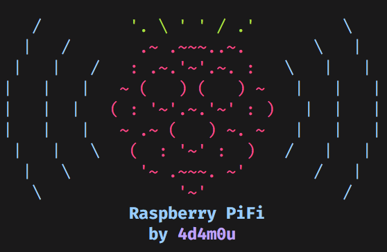

PiFi
========



[](https://saythanks.io/to/NicholasAdamou)

PiFi configures your Raspberry Pi as a wireless access point and connects to a given SSID.

What it Sets Up
------------
* HostAPD (Access Point) on `wlan0`
* WiFi Connection on `wlan1`

Requirements
------------

PiFi supports:

* Raspbian Jessie ([PIXEL](https://www.raspberrypi.org/downloads/raspbian/))
* Two WiFi Cards (e.g. On-board chip + [TL-WN725N](https://www.amazon.com/gp/product/B008IFXQFU/ref=oh_aui_detailpage_o03_s00?ie=UTF8&psc=1))
* Micro-USB to USB 2.0/3.0 converter (e.g. [USB to Micro-USB Charge & Sync Cable](https://www.amazon.com/gp/product/B00SVVY844/ref=oh_aui_detailpage_o05_s00?ie=UTF8&psc=1))
* Portable Battery Bank (e.g. [Anker PowerCore 5000](https://www.amazon.com/gp/product/B01CU1EC6Y/ref=oh_aui_detailpage_o02_s00?ie=UTF8&psc=1))

Older versions may work but aren't regularly tested. Bug reports for older
versions are welcome.

Install
-------

Download, review, then execute the script:

```
git clone git://github.com/NicholasAdamou/PiFi.git && cd PiFi && ./pifi.sh
```

Follow the on-screen directions.

It should take less than a minute to install.

More Information
-------

* [Setup WiFi on Raspberry Pi using Wicd](http://blog.ubidots.com/setup-wifi-on-raspberry-pi-using-wicd)

License
-------

PiFi is © 2017 Nicholas Adamou.

It is free software, and may be redistributed under the terms specified in the [LICENSE] file.

[LICENSE]: LICENSE
